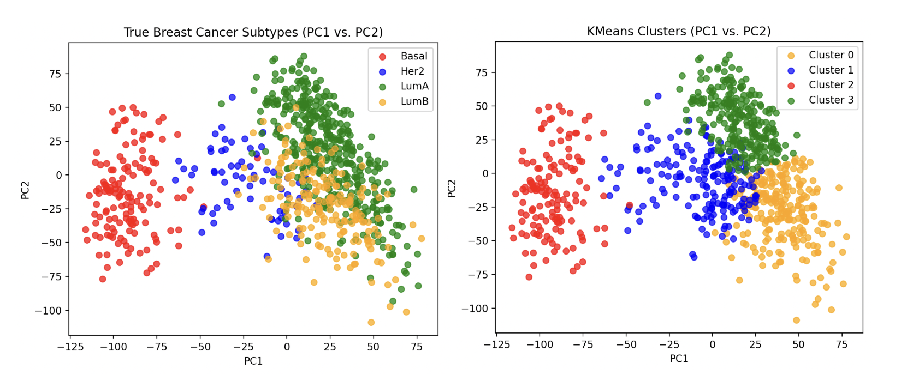
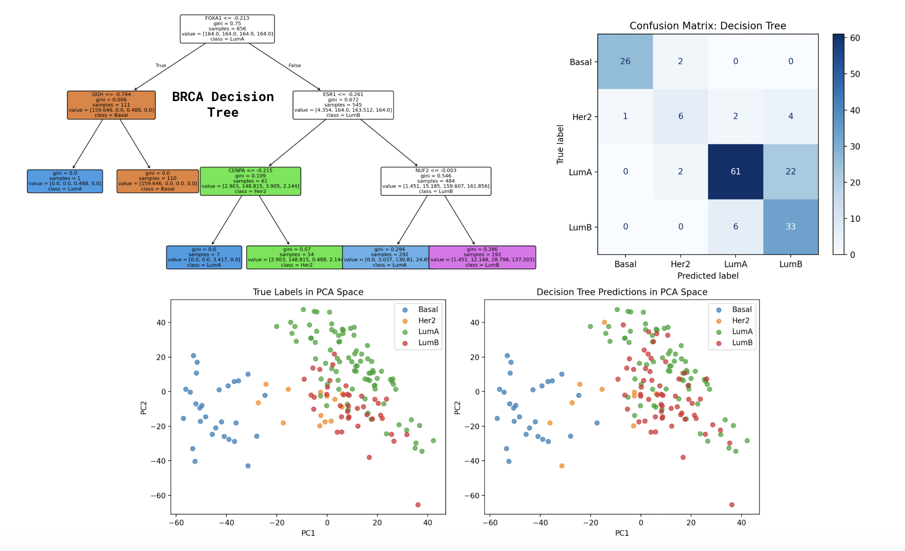
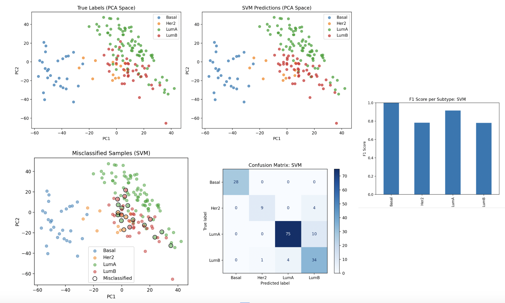
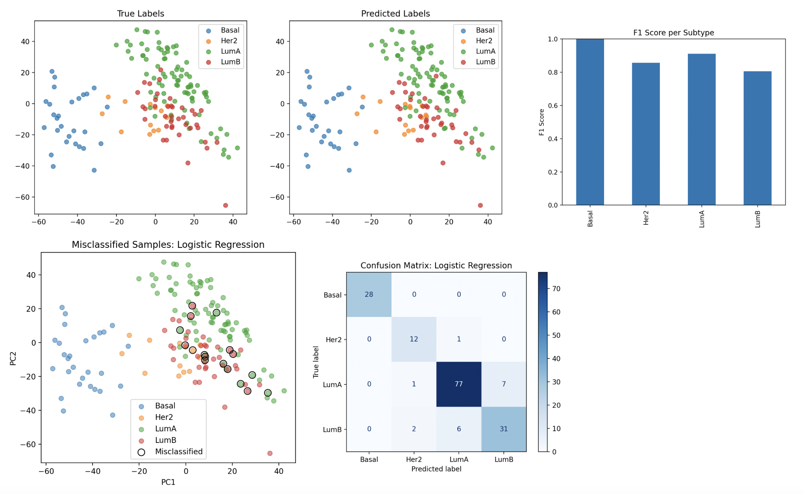

# Predictive Modeling of Breast Cancer Subtypes from Gene Expression Data

## Presentation Video
YouTube link: https://youtu.be/y20izmySjMg

## How to Build and Run the Code

This project uses a `Makefile` to install dependencies, prepare data, run analyses, train models, and execute tests. 
All commands should be run from the project root directory:

```bash
cd cs506_final_project
```
**Python Version: 3.9+**

### Setup
Create a virtual environment and install dependencies

```bash
python3 -m venv .venv
source .venv/bin/activate
make install
```

Installs all **required libraries** in `requirements.txt`

### Download Data 

Download Gene Expression data and Clinical Metadata as specified in *Data Collection* section

### Prepare Data
```bash
make prep
```
This runs `src/data_prep.py` which: 
   1. loads gene expression data and clinical metadata 
   2. merges them into a single dataframe 
   3. saves the processed file to `data/processed_brca_data.csv`

### Run Analyses & Models
_**Run & visualize** **analyses and models** using the following commands:_
```bash

make explore        # Data exploration
make unsupervised   # PCA + KMeans analysis

make tree           # Decision Tree
make svm            # SVM (RBF)
make logreg         # Logistic Regression
make pca_logreg     # PCA + Logistic Regression

```
### Running Tests & Automated Github Testing
***Basic checks** to ensure **correct structure** of the processed data*

```bash
make test
```

Tests are automatically executed on each push via: 

`.github/workflows/tests.yml`


## Project Overview

Breast cancer is one of the most common type of cancers, but it is not a single uniform disease. Although pateints  
receive the same diagnosis, tumors can differ significantly at a molecular level and these differences influence how 
aggressively a cancer behaves and how it responds to treatment. The classifications of breast cancer subtypes are 
**Luminal A, Luminal B, HER2, and Basal**. Identifying these subtypes traditionally requires time-intensive specialized 
laboratory testing. However, data generated through **RNA sequencing (RNA-seq)** has been proven to carry information for 
these classifications by **essentially measuring the activity levels of all genes within a tumor and outputting a gene 
expression profile.** 


The high-dimensionaltiy of these datasets (each tumor holds expression measurements for ~ 20,000 genes) make them quite 
complex to analyze manually. I would like to develop a data preparation procedure and supervised classification models that can 
**predict breast cancer subtypes from RNA-seq expression data** and **evaluate model performance.**

---

### Primary Objective

Evaluate the predictability of breast cancer molecular subtypes from RNA-seq gene expression data using supervised machine
learning models 

---

### Secondary Objectives 

1. **Assess subtype separability in gene expression space**
- Use PCA and unsupervised clustering (K-means) to explore natural biological structure

2. **Compare linear vs non-linear modeling approaches**
- Evaluate decision tree, SVM (RBF), and logistic regression
- Determine whether complex non-linear models are necessary to model the high-dimensional nature of the data


## Data Collection

The TCGA Breast Invasive Carcinoma (BRCA) dataset files were accessed via UCSC Xena Browser.

Data Source: https://xenabrowser.net/datapages/?cohort=TCGA%20Breast%20Cancer%20(BRCA)&removeHub=http%3A%2F%2F127.0.0.1%3A7222

#### Extracted Datasets
1. *Gene Expression Data*  
   - RNA-seq normalized gene expression values  
   - ~1,200 samples × ~20,000 genes per sample  
   - File: `TCGA.BRCA.sampleMap_HiSeqV2.csv`

2. *Phenotype Metadata*  
   - Contains molecular subtype labels and sample IDs 
   - Sample IDs used to merge gene expression data with subtype labels
   - File: `TCGA.BRCA.sampleMap_BRCA_clinicalMatrix.csv`
---
#### Setup Instuctions

-  Download files as **CSV** and **place into directory**: `data/` 

## Data Cleaning &  Processing

**Implementation**: `src/data_prep.py`

*To regenerate the processed dataset run:*

`make prep`

Constructing the processed dataset `processed_brca_data.csv` used for modeling

---
*Data Cleaning Steps*

1. *Gene Expression Processing* 
   - Loaded RNA-seq data (~ 20,000 genes) and transformed original format of genes x samples to samples x genes 
   - Allows us to treat genes as model features


2. *Clinical Metadata Processing* 
   -  Selected relevant columns: `sampleID`, `PAM50Call_RNAseq`, `sample_type`
   - `PAM50Call_RNAseq` is renamed to subtype 
   - Used `sample_type` to filter out "Normal" and keep only samples classified as "Primary Tumor"


3. *Merging Datasets* 
   -  Merged expression and clinical metadata dataframes on `sampleID` 
   - Final  dataset : `sampleID` x `gene expression features + subtype label`
 
---

**Final Output**

 `data/processed_brca_data.csv` : `(821 samples x 20,532 features) `

## Exploratory Analysis

**Implementation**: `src/data_exploration.py`

This stage examoines the structure of the processed data to understand any unique considerations to make before modeling


### Key Insights 

**1. Strong Subtype Distriution Imbalance** 

| Subtype | Samples | Proportion |
|--------|--------:|-----------:|
| LumA   |     421 | 0.512789   |
| LumB   |     192 | 0.233861   |
| Basal  |     141 | 0.171742   |
| Her2   |      67 | 0.081608   |
   *Class distribution visualized as bar plot for reference:* `figures/data_imbalance.png`


**2. Gene Expression Distribution**

- Wide range of expression values across genes
- Significant variability between samples

*Emphaseized need for feature selection & scaling during model training*

---
**Model Performance Evaluation Strategy**

Due to class imbalance, macro-averaged F1-score will be used to assess model behavior:

```
F1 Score = 2(precision * recall) / (precision + recall)
```

Macro F1 Score computes the F1-score for each subtype **independently** and averages the scores equally across all classes

- This ensures minority classes (e.g., HER2) are **not ignored** & model performance reflects all subtypes not 
    just dominant ones

## Feature Extraction

The feature extraction process consisted of three main steps:

1. Variance-based gene filtering  
2. Feature scaling (normalization)  
3. Dimensionality reduction (PCA)  


**Variance-based feature selection**

- Gene expression variance between samples are the main feature of interest to model separation of molecular subtypes.
- **Zero-variance** genes were removed
- Selected **top 5000 most variable genes**


**Dimensionality Reduction (PCA)**

For the best-performing model (Logistic Regression), Principal Component Analysis (PCA) was applied:

- Reduced feature space to 150 components (increased F1-score very slightly)
- Helped in reducing genes contributing to noise for model performance


## Model Training  & Evaluation

--- 
**Training Procedure**

The dataset was split into training and test sets using an 80/20 stratified split to account for the subtype ditribution 
imbalance across classes

**To Avoid Data Leakage ...**

All preprocessing and feature extraction steps were performed using the training data only to avoid data leakage:

- Removal of zero-variance genes
- Selection of the top 5,000 most variable genes
- Standardization using StandardScaler

The same transformations were then applied to the test set.

---

### **Exploratory (Unsupervised) Analysis**

Before training supervised models, unsupervised methods were used to assess the natural subtype structure: 

- PCA (n=50 components) was applied to visualize and retain most of the subtype variance in the data while reducing noise
- K-means clustering (k=4) was used to evaluate natural grouping & was presented very inaccurate clusters when visually 
compared side-by-side to true classification

---

### Model Selection 

1. **Baseline Model: Decision Tree**
- Assessing models ability to capture *gene function* and non-linear relationships between genes
- Explored different tree depths to capture when model begins to overfit 
- **Optimal Depth = 4**

**To generate decision tree model run**: `make tree`

*Evaluation extracted significant genes like FOXA1 (root node) and GGH (gini=0.006) to separate Basal subtype and presented a 
strong baseline for non-linear classification (macro_avg_f1 = 0.84)*

2. Support Vector Machine (RBF Kernel)
- Attempting to model non-linear decision boundaries
- Explored the idea that soft-margin penalty-based implementation would help account for the visual overlapping structure of classes
- Hyperparameters (C,gamma) were tuned using grid search BUT did not improve performance on the test set. Likely reflecting 
that the underling structure of the gene expression data may be quite stable.

**To generate svm (rbf) model run**: `make svm`

*Evaluation presented a strong increase in non-linear model performance (macro_avg_f1 = 0.88)*

3. Logistic Regression
- Evaluated classification as a linear model
- Performed better than the more complex SVM model, suggesting subtype separation may be directly 
influenced by gene expression 

**To generate logistic regression model run**: `make logreg`

4. PCA + Logistic 
- Applied PCA (n=150) to reduce dimensionality and identify noise affecing model performance

**To generate pca enhanced logistic regression model run**: `make pca_logreg`

---
### Model Evaluation 

Models were evaluated using Macro-averaged F1 score (as previously mentioned) and scores are visualized for with model 
outputting a bar chart gradually showing improvement or decline in classification for each subtype.


## Data Visualization & Results


### Exploratory Unsupervised Analysis 




*Presenting cluster similarity to true subtypes (quantified using Adjusted Rand Index ARI = 0.40)*

*Analysis evaluation presented **Basal tumors with clearest separation** while LumA, LumB, and Her2 **overlapped substantially.*** 


*The unsupervised analysis captured **some** biological structure but **motivated further supervised modeing approach**.*

---
### Model Comparison (Macro Avg F1 Score)

| Model                     | Macro Avg F1 |
|--------------------------|--------------|
| Decision Tree            | 0.84         |
| SVM (RBF)                | 0.88         |
| Logistic Regression      | 0.89         |
| PCA + Logistic Regression| **0.90**     |

---

### Decision Tree 


*Evaluation extracted significant genes like **FOXA1** (root node) and **GGH** (gini=0.006) to separate Basal subtype and presented a 
strong baseline for non-linear classification (macro_avg_f1 = 0.84)*

*The decision tree model **struggles with overlapping subtypes,** particularly **Luminal A and Luminal B***

---
### Support Vector Machine (RBF)



*SVM enhanced classificatiion significantly with **perfect Basal subtype classification**, minimal Her2 classification error, 
but still presenting some confusion between **Luminal A and Luminal B**. The model captures the more complex structure but still
presents **difficulty in a specific region** of the data shown in the Misclassified Samples (SVM) visualization*
---

### Logistic Regression (Best Performing Model)



*Logistic Regression is the best performing model, **outperforming** the previous **non-linear models**. The confusion matrix 
and F1-score bar charts show its **increased predictability in classifying Luminal A and Luminal B** subtypes accurately. However, 
the model still presents some misclassified points, but notably **less frequently and more scattered** than those from the SVM model.*

---
### Key Results 

- Logistic Regression combined with PCA achieved **strongest** performance (**Macro F1 ≈ 0.90**)
- Complex SVM (RBF) **did not outperform** simpler linear models


## Limitations and Future Work

### **Limitations**

- **Biological overlap** between subtypes (LumA vs LumB)
- Gene expression data is very high-dimensional, and it is difficult to **reduce noise** without **comprimising** 
possible **biological signal**
- TCGA dataset is not demographically balanced (predominantly White patients) which **limits the generalizability** of the model 
across other demographics

---

### Future Directions

- **Extract "gene sets"** that **group genes by pathway** to engineer **new features** 
- Validate performance of the model on external datasets, possibly minority populations to see varying model performance
- A neural network could be developed to **model how genes affect each other (promoters, enhancers, binding sites)** but 
would require much larger datasets 

## Repository Structure
```
cs506_final_project/
│
├── README.md
├── Makefile
├── requirements.txt
│
├── data/
│   ├── TCGA.BRCA.sampleMap_BRCA_clinicalMatrix.csv
│   ├── TCGA.BRCA.sampleMap_HiSeqV2.csv
│   └── processed_brca_data.csv                       # generated after data preparation
│
├── src/                                              # data prep/explore and model source code
│   ├── data_exploration.py
│   ├── data_prep.py
│   ├── unsupervised_analysis.py
│   ├── decision_tree.py
│   ├── SVM_rbf.py
│   ├── logistic_reg.py
│   └── pca_logreg.py
│
├── figures/                                          # aggreated figure-like visualizations for each model/analysis
│   ├── decision_tree.png
│   ├── explore_distribution.png
│   ├── log_reg.png
│   ├── pca_logreg.png
│   ├── SVM_rbf.png
│   └── unsupervised_analysis.png
│
└── tests/                                            # testing
    └── test_data.py

```

### Citations
TCGA UC Santa Cruz BRCA Data Set

